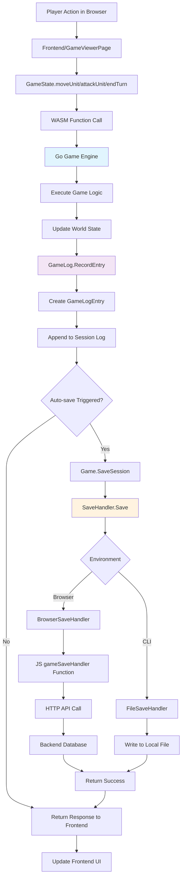
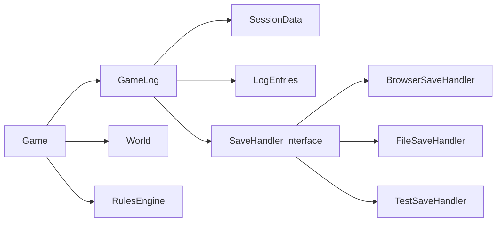
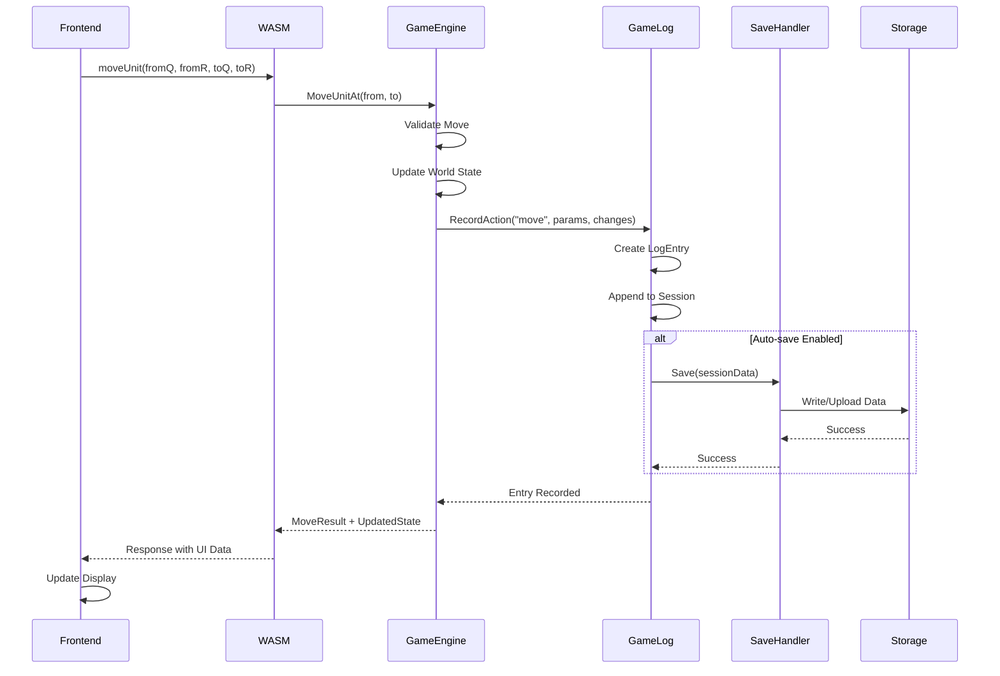

# GameLog System Design

## Architecture Overview



## Component Responsibilities

### Go Game Engine (Core)


### Data Flow for Game Actions


## Design Decisions

### 1. GameLog Ownership: Go Engine
**Decision**: GameLog lives entirely in the Go game engine, not the frontend.

**Rationale**:
- ✅ Consistent with existing architecture (all game logic in Go)
- ✅ Same GameLog code works in browser and CLI environments
- ✅ Frontend remains a thin UI layer focused on user interactions
- ✅ GameLog can be tested in Go without browser dependencies
- ✅ Automatic recording - no need to remember to log actions

**Alternative Considered**: Frontend-managed GameLog
- ❌ Would duplicate game state tracking logic
- ❌ Harder to test and validate
- ❌ Frontend would need deep knowledge of game state changes

### 2. Save Handler Interface Pattern
**Decision**: Use Go interface with environment-specific implementations.

**Rationale**:
- ✅ Flexible storage backends (API, files, memory, etc.)
- ✅ Easy to test with mock implementations
- ✅ Clean separation of concerns
- ✅ Same Go engine code works in all environments

**Implementation**:
```go
type SaveHandler interface {
    Save(sessionData []byte) error
    Load(sessionId string) ([]byte, error)
    List() ([]string, error)
}
```

### 3. Automatic vs Manual Recording
**Decision**: Automatic recording of all game state changes.

**Rationale**:
- ✅ Can't forget to record an action
- ✅ Consistent and complete logs
- ✅ Perfect for regression testing
- ✅ Enables save/load functionality automatically

**Implementation**: Every game action method (`MoveUnitAt`, `AttackUnitAt`, `EndTurn`) automatically calls `GameLog.RecordAction`.

### 4. WASM Function Exposure
**Decision**: Expose save/load operations as WASM functions.

**New WASM Functions**:
- `weewarSaveGame(sessionName)` - Save current session
- `weewarLoadGame(sessionId)` - Load and resume session
- `weewarGetGameLog()` - Get current session log for debugging
- `weewarListSavedGames()` - List available saved sessions

**Rationale**:
- ✅ Consistent with existing WASM API pattern
- ✅ Frontend remains simple - just calls WASM functions
- ✅ All persistence logic stays in Go

### 5. Storage Strategy
**Decision**: Configurable storage via SaveHandler interface.

**Browser Mode**: 
- `BrowserSaveHandler` calls JavaScript functions
- JavaScript functions make HTTP API calls
- Backend stores in database

**CLI Mode**:
- `FileSaveHandler` writes JSON files to disk
- Useful for development and single-player games

**Test Mode**:
- `MemorySaveHandler` stores in memory
- Perfect for unit tests and replay validation

## Data Structures

### GameLogEntry (Go)
```go
type GameLogEntry struct {
    ID        string                 `json:"id"`
    Timestamp time.Time             `json:"timestamp"`
    Player    int                    `json:"player"`
    Action    GameAction             `json:"action"`
    Changes   []WorldChange          `json:"changes"`
}

type GameAction struct {
    Type   string                 `json:"type"`   // "move", "attack", "endTurn"
    Params map[string]interface{} `json:"params"` // Action-specific parameters
}

type WorldChange struct {
    Type       string      `json:"type"`        // "unitMoved", "unitKilled", etc.
    EntityType string      `json:"entityType"`  // "unit", "player", "game"
    EntityID   string      `json:"entityId"`    // Identifier
    FromState  interface{} `json:"fromState"`   // Previous state
    ToState    interface{} `json:"toState"`     // New state
}
```

### GameSession (Go)
```go
type GameSession struct {
    SessionID        string          `json:"sessionId"`
    StartedAt        time.Time       `json:"startedAt"`
    LastUpdated      time.Time       `json:"lastUpdated"`
    WorldID          string          `json:"worldId"`
    StartingWorld    []byte          `json:"startingWorld"`
    Entries          []GameLogEntry  `json:"entries"`
    Status           string          `json:"status"` // "active", "completed", etc.
    Metadata         SessionMetadata `json:"metadata"`
}

type SessionMetadata struct {
    MapName      string                 `json:"mapName"`
    PlayerCount  int                    `json:"playerCount"`
    MaxTurns     int                    `json:"maxTurns"`
    GameConfig   map[string]interface{} `json:"gameConfig"`
}
```

## Implementation Benefits

### For Development
- **Incremental**: Build GameLog as we implement gameplay features
- **Automatic**: No need to remember to log actions - happens automatically
- **Testable**: GameLog enables automated replay testing of game logic

### For Users
- **Save/Load**: Players can save and resume games
- **Replay**: Watch recorded games for entertainment or debugging
- **Undo**: Future feature - GameLog enables undo functionality

### For Testing
- **Regression Testing**: Replay recorded sessions to catch rule changes
- **Performance Testing**: Measure WASM performance on real game sequences
- **Rule Validation**: Ensure complex multi-turn scenarios work correctly

## Future Extensions

### Multiplayer Support
GameLog provides foundation for real-time multiplayer:
- Each player action gets logged and synchronized
- Players can join ongoing games by replaying the log
- Spectator mode by streaming GameLog entries

### Analytics
GameLog enables detailed game analytics:
- Player behavior patterns
- Balance analysis (win rates by faction, map, etc.)
- Performance metrics (average game length, common strategies)

### AI Training
Recorded GameLogs can be used to train AI players:
- Learn from human gameplay patterns
- Validate AI decisions against human players
- Generate training datasets for machine learning

## Implementation Status

### ✅ Completed (January 2025)
- **Core GameLog System**: GameAction, WorldChange, GameLogEntry, GameSession data structures
- **Simplified SaveHandler Interface**: Only Save() method needed - UI handles loading directly
- **Game Integration**: GameLog integrated into Game struct with automatic recording
- **Action Recording**: MoveUnit, AttackUnit, NextTurn all automatically logged
- **Go-Centric Architecture**: All GameLog logic in Go engine, frontend agnostic
- **WASM Integration**: saveGame() and loadGame() functions exposed to frontend
- **Simplified Architecture**: Each game is a single session, no complex session management
- **Frontend Integration**: GameState.ts save/load methods with JavaScript bridge functions
- **BrowserSaveHandler**: Moved to WASM package, directly instantiated by game creators

### ⏳ Next Steps
- **Backend API**: Implement /api/v1/games/sessions endpoint for save operations
- **GameViewerPage UI**: Add save/load buttons and DOM-based loading
- **Session Replay Logic**: Complete loadGame implementation with action replay
- **Testing Validation**: Use GameLog for automated replay testing

### 🔧 Architecture Simplifications Made
- **Removed Load/List/Delete**: SaveHandler only needs Save() - UI passes data directly to WASM
- **Removed Factory Pattern**: Game creators directly set SaveHandler instances instead of config-based factory
- **Single Session Model**: gameId = sessionId, no complex session management needed
- **WASM-Owned BrowserSaveHandler**: Moved from lib to wasm package where it belongs

---

*This design provides a solid foundation for save/load functionality while maintaining our clean architecture where the Go engine owns all game logic and the frontend focuses purely on user interaction.*